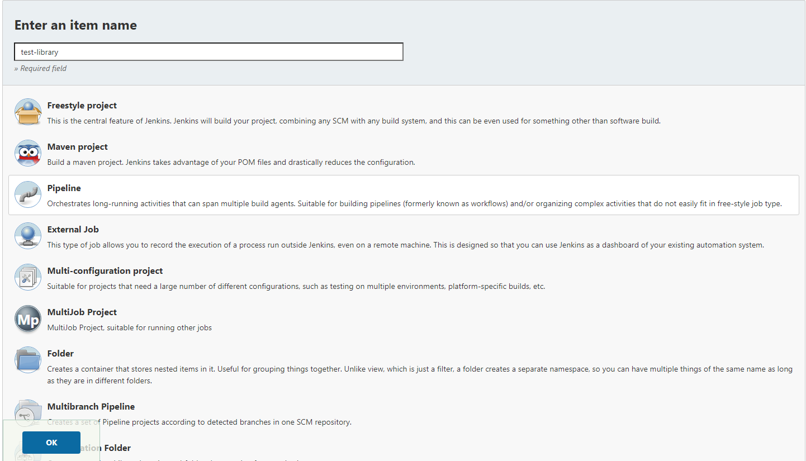
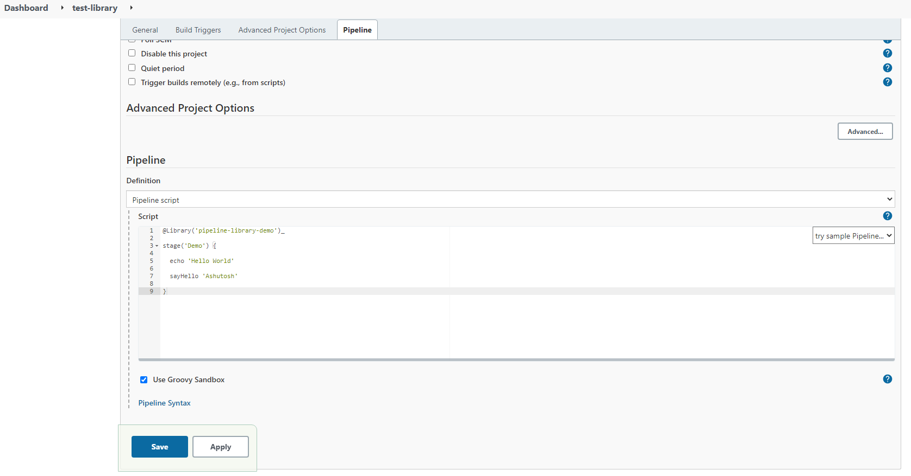

# pipeline-library-demo

Demonstrates how to use a Shared Library in Jenkins pipelines. This repository defines a single function, `sayHello`, which will echo a greeting.

## Setup instructions

1. In Jenkins, go to Manage Jenkins &rarr; Configure System. Under _Global Pipeline Libraries_, add a library with the following settings:

   - Name: `pipeline-library-demo`
   - Default version: Specify a Git reference (branch or commit SHA), e.g. `master`
   - Retrieval method: _Modern SCM_
   - Select the _Git_ type
   - Project repository: `https://github.com/ashutoshsahoo/pipeline-library-demo.git`
   - Credentials: (leave blank)

   &nbsp;
   

2. Then create a Jenkins job with the following pipeline (note that the underscore `_` is not a typo):

   ```groovy
   @Library('pipeline-library-demo')_

   stage('Demo') {

     echo 'Hello World'

     sayHello 'Ashutosh'

   }
   ```

   

   This will output the following from the build:

   ```sh
   [Pipeline] stage
   [Pipeline] { (Demo)
   [Pipeline] echo
   Hello world
   [Pipeline] echo
   Hello, Dave.
   [Pipeline] }
   [Pipeline] // stage
   [Pipeline] End of Pipeline
   Finished: SUCCESS
   ```

3. To use _develop_ branch inside a Jenkins job with the following pipeline:

   ```groovy
   @Library('pipeline-library-demo@develop')_

   import com.ashu.practice.GlobalVars
   import com.ashu.practice.Employee

   pipeline {
      agent any
      stages {
         stage('Demo') {
            steps {
               echo 'Hello, world'
               sayHello 'Ashutosh'

               echo 'The value of foo is : ' + GlobalVars.foo

               script {
                  employee = new Employee()
                  employee.age = 21
                  employee.increaseAge(10)
                  echo 'Incremented age, is now : ' + employee.age
               }
            }
         }
      }
   }

   ```

   This will output the following from the build:

   ```sh
   [Pipeline] {
   [Pipeline] stage
   [Pipeline] { (Demo)
   [Pipeline] echo
   Hello, world
   [Pipeline] echo
   Hello, Ashutosh.
   I am inside library.
   [Pipeline] echo
   The value of foo is : bar
   [Pipeline] script
   [Pipeline] {
   [Pipeline] echo
   Incremented age, is now : 31
   [Pipeline] }
   [Pipeline] // script
   [Pipeline] }
   [Pipeline] // stage
   [Pipeline] }
   [Pipeline] // node
   [Pipeline] End of Pipeline
   Finished: SUCCESS
   ```
